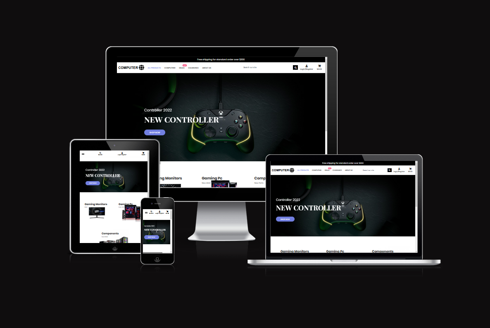

# **Computer World**

[**View the live project here**](https://preet-computer-world.herokuapp.com/)

## **Contents**
1. [**Introduction**](#Introduction)

2. [**User Experience**](#User-Experience)

   - [**Strategy**](#strategy)
   - [**Scope**](#Scope)
   - [**Structure**](#Structure)

3. [**Databases**](#Databases)

4. [**Design**](#Design)

5. [**Features**](#Features)

6. [**Bugs**](#Bugs)

7. [**Other Features**](#Other-Features)

8. [**Technologies Used**](#Technologies-Used)

9. [**Frameworks Libraries and Programs Used**](#Frameworks-Libraries-and-Programs-Used)

10. [**Testing**](#Testing)

    - [**Testings.md**](assets/testing-file/testing.md)

11. [**Deployment**](#Deployment)

12. [**Make a clone**](#Make-a-clone)

13. [**Credit**](#Credit)

14. [**Acknowledgements**](#Acknowledgements)

## **Introduction**

This is my 5th and final portfolio project at code institute. This project is designed to be an Online Computer Retailer, which allows the customer to buy computer products and components. This project is a computer shop website designed to advertise the shop and to allow the customer to buy products and components. On the website, customers can buy any product as a guest as they don’t need to register to buy any product. But if they want to save their information then they must register. This website has been deployed on Heroku.

[View the live project here](https://preet-computer-world.herokuapp.com/)

[Go Top](#Computer-World)

## **User Experience**

### **Strategy**
I will start with the Strategy - thinking about the target audience for this gallery & the features they would benefit from.

The target audience for 'Computer World' are:

- Computer Enthusiasts.
- IT Professionals.

These users will be looking for:

- Any product on the website, easy to check detail and purchase.
- All the products price, description, and new product up to date every day.
- User account functionality to view past orders and store billing information.
- Sign up newsletter for see deals, new products everyday.

### **User Stories**

Please find all my defined user stories & their acceptance criteria [here](https://github.com/preetbhullar90/computer-world/issues)

### **1. Sort and Searching products:**

- As a **shopper** I can **sort the list of all the products** so that I can **easily find the best price, high rate and sorted by product category.**
- As a **shopper** I can **sort product by specific categories** so that **I can sort product by specific category and find best price and best rates.**
- As a **shopper** I can **search a product by name or description** so that **I can easily find a specific product by name which I’d like to purchase.**
- As a **shopper** I can **see what I’ve searched for and the number of results** so that **I can easily decide whether the product I want is available.**

### **2. Viewing and Navigation Functionality:**

- As a **shopper** I can **view all the products** so that **I can select some products to purchase.**
- As a **shopper** I can **see individual product details** so that **I can see product description, price, image, and sizes.**
- As a **shopper** I can **identify deals and special offers** so that ** I can take advantage of special savings some money on a product.**
- As a **shopper** I can **see grand total of money and all product which I selected** so that **I can save lot of time.**

### **3. Purchase and checkout products:**

- As a **shopper** I can **easily select a size and quantity of product** so that **I can select right size and quantity of a product when I buy it.**
- As a **shopper** I can **easily view items in my bag** so that **I can identify the total cost of purchase.**
- As a **shopper** I can **adjust the quantity of my bag** so that **I can make any changes before buy.**
- As a **shopper** I can **add my personal payment information safe and secure** so that **I can confidently provide the information to make a purchase.**
- As a **shopper** I can **view my order confirmation after checkout** so that **I can easily see that I didn't make any mistake.**
- As a **shopper** I can **receive confirmation email after checkout** so that **I can keep that email as a proof what I have brought from store.**

### **4. Admin and Store management:**

- As a **shop owner** I can **add new product** so that **I can add new items to my store.**
- As a **shop owner** I can **easily Edit and Update a product** so that **I can update images prices and other criteria.**
- As a **shop owner** I can **easily delete a discontinued product** so that **I can Remove items from store site.**

### **5. User Authentication:**

- As a **user** I can **create a personal user profile** so that **I can view my personal order and save my payment information.**
- As a **user** I can **receive a confirmation email after registering an account** so that **I can verify that my account registration was successfully.**
- As a **user** I can **recover my password in case I forget it** so that **I can recover access to my account.**
- As a **User** I can **login or logout my account** so that **I can access my personal account information.**
- As a **user** I can **create a personal account** so that **I can view my profile.**

### **Scope**

To achieve the desired user & business goals, the following features will be included in this website:
- A Responsive website to open on any devices like desktop, tablet and mobile.
- Home page with three different backgrounds banners and shopping buttons and with all the information to be found on the website.
- Logged in users can see their name on the navbar.
- Register/login feature using Django All AUTH so that users can create an account.
- 404 error page added to go home page if there is an error.

### **Structure**

In this website I have used seven apps:
1.	About us – location
2.	Bag – All products basket
3.	Checkout – cards details
4.	Contact – user feedback
5.	Home – Information about all the pages
6.	Products- All products
7.	Profiles- users information

## **Databases**

The about us, checkout, products, and profile apps require databases to store information, so I have built 6 custom models. I connected this website to the Heroku Postgres database which is provided by Heroku as an add-on.

These models are following this flow diagram:

### **About us**
In the about us app, I created one model named ‘Newsletter Users’. This model that provides email to display subscribe and unsubscribe newsletter of the computer world.

### **Checkout**
There are two models in the checkout app, ‘Order’ and ‘OrderLineItem’. These 3 models allow for the customer details, products size and quantity to be stored.

For each checkout, there will be a customer detail, delivery cost, and grand total form which comes from Order models. The customer must fill in this form to make a payment but if the customer logged in and saved their information beforehand, then the form will already be filled so they would only need to add their card details.

With the ‘OrderLineItem’, the customer will be able to retrieve all the information about the product, such as their name, size, and quantity.

### **Products**
In the products app, I created two models named Products & Category. This app controls the products that are displayed in the online shop.

Products enables individual products to be added to the database for the customer to be buy through online shop. Only admin users can add, edit, and delete products from the front end and the admin page, but the normal user can see and buy the products. The ‘Category’ model connects to the products through the foreign key.

Category stores various types of categories like monitors, graphics card, components, laptops etc. This category allows to users to find a specific product from the website.

### **Profiles**
The Profile app allows users to save their information, so that when they are logged in and they want to purchase any product, they will get a prefilled form to save their time. The `UserProfile` model has a one-to-one field that is linked to the Django All AUTH user account, and upon logging in the model method `create_or_update_user_profile` creates the profile if it isn't already present in the model.

## **Design**

### **Colour Schema**

- I used three colours for the background and content, which are white, black, and blue. I have also used a small amount of green in the add to basket button.

- I used blue from the theme waGon website, Black and white from the code institute project ‘Boutique ado’, and Green I checked add to basket button colour online.

### **Typography**

- I selected the font I used from the Google font website and linked it with my CSS file.

- I used three font styles: Poppins-Regular, Poppins-Light, Poppins-ExtraLight, Poppins-Medium, Poppins-Italic, Poppins-Italic, Poppins-SemiBold, sans-serif.

-  I have used the font Sans-serif as a backup in instances where if the correct link is not provided to the css3 file.If this occurs and the Google font does not work the backup font sans-serif will always work.

### **Imagery**

- The background images used in this website plays a vital role in the user’s experience of the website.
- The images shown on the website has been selected to convince the customer purchase the products.
- The Images are downloaded for free from the [Ebuyer](https://www.ebuyer.com/) [razer](https://www.razer.com/gb-en) [corsair](https://www.corsair.com/uk/en/) website.

### **Skeleton**

- I used [Figma](https://www.figma.com/file/xGZ1gadhIzf7MHrQTEKplK/Computer-world?node-id=0%3A1 "Link to Figma homepage") Wireframe for the website.

### **Markting**

To further enhance sales there is also a computer world Facebook page, which will display all products that are for sale:

### 1. **Features**
### 2. **Header**
### 3. **Home Page**
### 4. **Products Page**
### 5. **Detail Page**
### 6. **Basket Page**
### 7. **Checkout Page**
### 8. **Product Management**
### 9. **Profile Page**
### 10. **About Page**
### 11. **Contact Page**
### 12. **Error Page**

- ### **Header**

In the header the main logo of the website is on the left-hand side, and the navigation links are on the right-hand side on all pages. On medium and small-sized devices such as tablets and mobile, the logo and navigation links hide behind the hamburger logo.

- ### **Home Page**
The home page has three big hero images in the back. On the images I have added one button, button is linked to the products page. Under the hero images, there are three sections in the first section, there where is a monitor purchase link with an image. In the second section, there is a pc section, there where is a pc purchase link with an image. Last section, there is a components section for purchase all the pc parts. Under these sections, there is a footer, where I added all the page links, sitemap, subscribe, unsubscribe so on.

- ### **Products Page**
The products page displays all products. On the left side of the page, users can see how many products are on this page and on the right side of the page, I added a filter to sort the products by name, price, category, rating and so on. Under the filter, there are all the products, there are four products in row on desktop, two products in row on tablet and one product in row on mobile devices. All products have an image, name, rating, and description. Under the description users can see the price. Under the price I added two buttons; the first button is to add products to the basket and the second button is to see the product details. There is a footer, where I added all the pages links, sitemap, subscribe, unsubscribe so on.

- ### **Details Page**
The details page has a banner on the top where users can see “free shipping over £200”. Under this banner,In the middle, users can see a bigger image when they click on the three smaller images, or they can also click the left and right arrows on big image to change image. Users can also download the image by clicking on one the white arrow on the top of the right corner of the big image. On the right side of the big image, users can see the product’s name, price, description so on. Under the description users can change the quantity of the product by clicking the plus or minus buttons. On the right side of the quantity button, there is a green button to add the product to the basket. To the bottom of this button, there is a button if the user wants to do more shopping. Under these buttons, users can see more additional information like product weight, height, reviews so on.

- ### **Basket Page**
The basket page has an overview of all the items added by the user. The information is displayed in a table that has product name, image, quantity, price, and subtotal. The user can change the quantity of each product and remove it while on this page, and below there are two buttons to proceed to the checkout or to keep shopping.

- ### **Checkout Page**
On the checkout page, where the user can complete their purchase, is split into two columns, with billing & card details on one side and their basket overview on the other. The forms are simple, with placeholders explaining what each input is for.

- ### **Product Management**
The admin section of this website allows a logged-in superuser to update the product models from the front end. Products can be added using the product management dropdown, where the superuser is taken to a form whereupon submission of the product is added to the model.

- ### **Profile Page**
On the profile page, users can see their previous order history. Users can only see this page if they are logged in. On the left side is the order history, where users can see or update their delivery information.

- ### **About Page**
The about page has a background image, which shows quality of the products we supply to the customers. Under the image, there is a company history containing details such as when the company  was established, what kind of products they sell, and the location of the warehouse. On the right side, there is an image of the warehouse. Under this image, there is whole section about the delivery and customer service. On the left side, there is a company customer care staff image.  Under these sections, there is a footer, which contains all the pages links, sitemap, and subscribe/unsubscribe buttons.

- ### **Contact Us Page**
The Contact Us page has a background image, which shows quality of the company. Under this image, there is form on the left side where customers can send any feedback or any problems, via email to the company. On the right side of this form, customers can see the company address, phone number, and email. Under these sections, there is a map showing where company is situated. Under this map, there is a footer, which contains all the pages links, sitemap, and subscribe/unsubscribe buttons.

- ### **Error Page**
I have added a custom 404 error page using this [template](https://codepen.io/adnenrebai/pen/KNqQJP); this allows the user to easily navigate back to the home page should they experience any errors.

## **Other Features**

- The logo is linked to the home page so that when the user clicks on the logo it will take them to the home page.
- On the form page, the navigation bar and email have a hover option. When the user hovers their mouse over the navigation bar it will highlight to a different colour. This makes it easier for the user to understand that this is a clickable link.

## **Technologies Used**

### **Languages Used**
* [HTML5](https://en.wikipedia.org/wiki/HTML5)
* [CSS3](https://en.wikipedia.org/wiki/CSS)
* [Python](https://en.wikipedia.org/wiki/Python_(programming_language))
* [Javascript](https://en.wikipedia.org/wiki/JavaScript)
* [Jquery](https://en.wikipedia.org/wiki/JQuery)

### **Frameworks Libraries and Programs Used**

* [Django](https://www.djangoproject.com/)
  * Django is the framework that has been used to build the over project and its apps.

* [Bootstrap](https://getbootstrap.com/)
  * Used for creating responsive design.

* [Font Awesome](https://fontawesome.com/ "Link to FontAwesome")
  * Font awesome was used to import all the icons on the website.

* [Google Fonts](https://fonts.google.com/ "Link to Google Fonts")
  * Google fonts was used to import the google style fonts in css for example Lato, Oswald and sans-serif.

* [Git](https://git-scm.com/ "Link to Git homepage")
  * Gitpod was used to write code in the terminal. It was also used to commit and push the code into GitHub.

* [GitHub](https://github.com/ "Link to GitHub")
  * GitHub was used to store the data which was pushed by Gitpod.

* [Gitpod](https://www.gitpod.io/)
    * Used as the development environment.

* [Heroku](https://dashboard.heroku.com/apps)
    * Used to deploy my application.

* [Pep8](http://pep8online.com/)
    * Used to test the code for any issues or errors.

* [Figma](https://www.figma.com/ "Link to Figma homepage")
  * Figma was used to create the wireframe of the project before starting code on the terminal.

* [Cloudinary](https://cloudinary.com/)
    * Used to store all of my static files and images.

* [Favicon.io](https://favicon.io/)
    * Used to create favicon's for my website

* [Am I Responsive?](http://ami.responsivedesign.is/# "Link to Am I Responsive Homepage")
  * Am I Responsive was used to see if project is responsive on different types of devices.

- [W3C Markup Validation Service](https://validator.w3.org/)
    - Used to validate all HTML code written and used in this webpage.

* [W3C CSS Validation Service](https://jigsaw.w3.org/css-validator/#validate_by_input)
    * Used to validate all CSS code written and used in this webpage.

* [JSHint](https://jshint.com/)
    * Used to validate JS code.

* [SQLite](https://www.sqlite.org/index.html)
    * I have SQLite to run my database tests locally.

* [PostgreSQL](https://www.postgresql.org/)
    * I have used Heroku's PostgreSQL relational database in deployment to store the data for my models.

* [Aws](https://aws.amazon.com/)
    * I used Amazon AWS S3 to store all my media files.

## **Testing**
The testing process can be found  [here](assets/testing-file/testing.md)

## **Bugs**

One bug present is when users click on the Login/Register button on the nav bar, they must double click to open dropdown menu. I have tried to fix it, but I have been unable to find a solution.

## **Deployment**

To deploy a Django application, The following options were used:
1.	Click the `Use This Template` button.
2.	Add a repository name and description.
3.	Click the `Create Repository from Template` to create your repository.
4.	To create a Gitpod workspace you then need to click `Gitpod`, this can take a few minutes.
5.	When you want to open your project you can go into github and click on your repository, then click on gitpod, or you can open with the gitpod workspace as well.
6.	when you change or write down new things you have to commit your work in github, use the following commands to make your commits:

    - `git add .`: adds all modified files to a staging area
    - `git commit -m "A message explaining your commit"`: commits all changes to a local repository.
    - `git push`: pushes all your committed changes to your Github repository.

### **Make a Clone**

1. [Login](https://github.com/)

2.	Click on Your Repository option and select your project

3.	Click on the code dropdown menu.

4.	To clone the repository using HTTPS, click "Clone with HTTPS", and copy the link.

5.	In your local IDE open the Git Bash terminal.

6.	Change the current working directory to the location where you want the cloned directory to be made.

7.	Type git clone, and then paste the URL you copied in Step 3.

           git clone https://github.com/USERNAME/REPOSITORY

8.	Press Enter. Your local clone will be created.

9. After this you need to cretae your own virtual environment, virtual environments are where dependencies are stored, You must activate the virtual environment using the source venv/bin/activate. To create the virtual environment use the following command in the terminal:

             python3 -m venv venv
             source venv/bin/activate

10. Then you need to intsall the requirements.txt file with the following command:

             pip install -r requirements.txt

11. Create a secret key for the django app. It is easy to create, just type **Django Secret Key Generator** in the browser, then click on create a key copy and paste it in the setting.py.

12. Rename your project.

13. Migrate all your settings, the only migrations that should appear in each of your app’s migrations folders are called ‘__init__.py’. You  can delete any existing migrations and migrate from scratch. For migrations and migrate settings you need to run the following command in the terminal:

         python manage.py makemigrations
         python manage.py migrate

14. Then you need to create a superuser to login to the admin page. To create the super user you need to run the following command:

        python manage.py createsuperuser

15. Finally, Start the development server and ensure everything is running without errors by useing the following command:

         python manage.py runserver

### **Forking a Repository**

1.	[Login](https://github.com/) into GitHub.

2.	On the top right, click the fork button.

3.	You will get a copy of the repository in your GitHub account.

### **Gmail SMTP**

I have used Gmail SMTP to send confirmation emails and all AllAuth related emails when the deployed version is used. I used the following [documentation](https://kinsta.com/blog/gmail-smtp-server/) to set it up and add these settings to my settings.py file:

### **Stripe**
In order to take payments for the online store, I implemented Stripe; you first must create an account with them and then using the [documentation](https://stripe.com/docs) add the relevant HTML, python & JS code suitable for your needs.

### **AWS static and media storage**
All static and media files are stored in the cloud using Amazon AWS S3; I have created a bucket, user group and user that can access this site and the relevant files. For the files to be correctly served the following settings must be added to your main settings.py file:

### **Heroku**
This site was deploy via Heroku.

This project was developed using a template provide by code institute however the template was upgraded to improve its functionality, which you can see in the commit.

To deploy this project on Heroku I used followed these steps:

- The following command in the Gitpod CLI will create the relevant files needed for Heroku to install your project dependencies `pip3 freeze --local > requirements.txt`. Please make sure this file should be added to a .gitignore file to prevent the file from being committed. A `Procfile` is also required that specifies the commands that are executed by the app on startup.

1. [Login](https://dashboard.heroku.com/apps) into Heroku.

2. In the main Heroku dashboard select ‘New’in the top right corner.

3. In the drop down, menu select ‘Create New App’.

4. Give a name related your project. I gave mochi-restaurant to my project.

5. Select the region you are working in.

6. When you see green text with your project name then press ‘create app’button.

7. From the dashboard select ‘setting’option.

8. You will need to set your Environment Variables - this is a key step to ensuring your application is deployed properly.

9. In the Settings tab, click on `Reveal Config Vars` and set the following variables:
    - SECRET_KEY - to be set to your chosen key
    - CLOUDINARY_URL - to be set to your Cloudinary API environment variable

10. In the resources tab you must install 'Heroku Postgres'

11.	In the buildpacks select python pack, save it then repeat with the nodejs pack.

12.	After this scroll up and select the `Deploy` option.

13. In the ‘deploy’ option select ‘GitHub’ option to select your project which one you want to deploy on Heroku, choose your project and connect to the Heroku.

14. After connecting your project to Heroku scroll down on Automatic Deploys button.

15. This will ensure whenever you change something in the repo and push the changes to GitHub, Heroku will rebuild the app. If you select this manually you can manually deploy options further down. For this project, I did Automatic Deployment to enable me to check changes I made to the app as I developed it.

16. Heroku will now build the app for you. Once it has completed the build process you will see a 'Your App Was Successfully Deployed' message and a link to the app to visit the live site.

*Heroku CLI deployment the app with and used the following commands to push the code to Heroku*:
1.	Login to Heroku via the CLI using `heroku login -i`
2.	Enter your email and password
3.	Connect to the Heroku git remote using the `heroku git:remote -a YOURAPPNAME`
4.	Push to the Heroku git remote using `git push heroku main`

## **Credit**
### **Content**

Products images, heading and descriptions were taken from [Ebuyer](https://www.ebuyer.com/), [Razer](https://www.razer.com/gb-en) and [Corsair](https://www.corsair.com/uk/en/) website.

### **Code**
* All code I  followed to code institute ado-boutique project.

* [Django models](https://www.youtube.com/watch?v=EI02wQ51GjA&list=PLBTOBXTz1YFZK0moSgoZq93V_AdvrUGSj)
* [Testing](https://www.youtube.com/watch?v=0MrgsYswT1c)
* [Coverage](https://coverage.readthedocs.io/en/6.2/)
* [Gmail SMTP](https://www.youtube.com/watch?v=TZL-WFzvDJg)
* [XML sitemaps](https://www.xml-sitemaps.com/)
* [Crispy Forms](https://django-crispy-forms.readthedocs.io/en/latest/)
* [Django Allauth](https://django-allauth.readthedocs.io/en/latest/installation.html)

### **Media**

* All images were download for free from [Ebuyer](https://www.ebuyer.com/), [Razer](https://www.razer.com/gb-en) and [Corsair](https://www.corsair.com/uk/en/).
* The website template i downloaded free from [theme waGon](https://themewagon.com/theme-tag/restaurant-template/) website.

## **Acknowledgements**
* I would especially like to thank my wife, who helped me by giving me some ideas regarding my website. She motivated me to finish this project to the best of my ability.
* Lastly I would like to thank my mentor Precious ljege, who helped during the whole process of the project.
